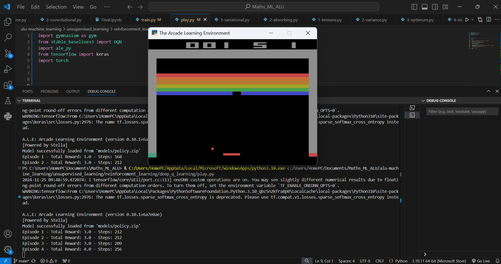

# dqn_atari

# DQN-Atari Breakout

This project uses a DQN to train an agent that can play Breakout, a classic Atari game, using reinforcement learning. The project uses the Gymnasium environment to simulate the game, Stable Baselines3 for reinforcement learning, and TensorFlow and PyTorch for model conversion.


## Project Overview
This project consists of:
- Training a DQN agent using the Stable Baselines3 library.
- The trained agent is ran as it interacts with the game environment using Gymnasium and executes actions to maximize the reward.
- The PyTorch trained model is optionally converted to .h5 format for easier deployment with Keras.


## Set Up Instructions
- Having a python version of 3.6 or higher in your PC.
- Cloning the repository to your local machine using:
  ```https://github.com/Esther-Mbanzabigwi/dqn_atari```
- Installing the dependencies listed in the ```requirement.txt``` file:
  
  ```pip install -r requirements.txt```

## How to run the pre-trained agent
- Run the ```train.py``` file to train the agent which will save the model in a **models** directory where you can access the pre-trained model saved as **policy.zip**
- To run the agent using the pre-trained model (that is **policy.zip**), just simply run ```python play.py```. This will start the agent and it will play the Breakout for 5 episodes. Then, the total reward and steps for each episode will be printed in the command line.

## Here is how it looks like:

